# Diccionario de Datos de Nexo

## Alcance

Este documento describe el esquema definitivo de trabajo para Nexo, basado en `context/nexo_laravel13_definitive_schema.sql`.

Los nombres de tablas, campos, rutas, módulos técnicos y permisos se mantienen en inglés para conservar compatibilidad con Laravel 13, Eloquent, migrations, seeders y factories.

Schema: `nexo`

## Convenciones Laravel 13

- Las tablas usan nombres plurales en `snake_case`.
- Las llaves primarias se llaman `id`.
- Las llaves foráneas usan singular más `_id`, por ejemplo `document_type_id`, `enterprise_id`, `quotation_id`.
- Los nombres de constraints siguen el estilo Laravel: `table_column_foreign`.
- Las tablas de dominio comercial usan `ON DELETE RESTRICT` y `ON UPDATE RESTRICT`.
- Las tablas propias de equipos mantienen el comportamiento existente: `team_members` y `team_invitations` usan `ON DELETE CASCADE`; `users.current_team_id` usa `ON DELETE SET NULL`.
- El esquema evita llaves primarias compuestas, porque Eloquent no las soporta de forma nativa.

## Módulos Principales

| Módulo | Tablas |
| --- | --- |
| Auth y sesión | `users`, `password_reset_tokens`, `sessions` |
| Infraestructura Laravel | `cache`, `cache_locks`, `jobs`, `job_batches`, `failed_jobs` |
| Teams | `teams`, `team_members`, `team_invitations` |
| Navegación | `menus` |
| Configuración base | `document_types`, `document_classes`, `document_statuses`, `currencies`, `taxes` |
| Clientes y contactos | `enterprises`, `people`, `contacts` |
| Catálogo comercial | `services`, `plans`, `plan_items` |
| Flujo comercial | `quotations`, `quotation_items`, `proposals`, `proposal_items`, `collection_accounts`, `collection_account_items`, `invoices`, `invoice_items` |
| Pagos | `payment_methods`, `banks`, `bank_accounts`, `payment_destinations`, `payments` |
| Documentos | `document_templates`, `document_template_versions`, `collection_account_attachments`, `invoice_attachments` |

## Diagrama Entidad Relación

```mermaid
erDiagram
    users ||--o{ team_members : team_members_user_id_foreign
    teams ||--o{ team_members : team_members_team_id_foreign
    teams ||--o{ team_invitations : team_invitations_team_id_foreign
    users ||--o{ team_invitations : team_invitations_invited_by_foreign
    teams ||--o{ users : users_current_team_id_foreign

    menus ||--o{ menus : menus_menu_id_foreign

    document_types ||--o{ enterprises : enterprises_document_type_id_foreign
    document_types ||--o{ people : people_document_type_id_foreign
    enterprises ||--o{ contacts : contacts_enterprise_id_foreign
    people ||--o{ contacts : contacts_person_id_foreign

    plans ||--o{ plan_items : plan_items_plan_id_foreign
    services ||--o{ plan_items : plan_items_service_id_foreign

    enterprises ||--o{ quotations : quotations_issuer_enterprise_id_foreign
    enterprises ||--o{ quotations : quotations_customer_enterprise_id_foreign
    contacts ||--o{ quotations : quotations_contact_id_foreign
    currencies ||--o{ quotations : quotations_currency_id_foreign
    document_statuses ||--o{ quotations : quotations_document_status_id_foreign

    quotations ||--o{ quotation_items : quotation_items_quotation_id_foreign
    services ||--o{ quotation_items : quotation_items_service_id_foreign
    plans ||--o{ quotation_items : quotation_items_plan_id_foreign
    taxes ||--o{ quotation_items : quotation_items_tax_id_foreign

    quotations ||--o{ proposals : proposals_quotation_id_foreign
    enterprises ||--o{ proposals : proposals_issuer_enterprise_id_foreign
    enterprises ||--o{ proposals : proposals_customer_enterprise_id_foreign
    contacts ||--o{ proposals : proposals_contact_id_foreign
    currencies ||--o{ proposals : proposals_currency_id_foreign
    document_statuses ||--o{ proposals : proposals_document_status_id_foreign

    proposals ||--o{ proposal_items : proposal_items_proposal_id_foreign
    services ||--o{ proposal_items : proposal_items_service_id_foreign
    plans ||--o{ proposal_items : proposal_items_plan_id_foreign
    taxes ||--o{ proposal_items : proposal_items_tax_id_foreign

    proposals ||--o{ collection_accounts : collection_accounts_proposal_id_foreign
    enterprises ||--o{ collection_accounts : collection_accounts_issuer_enterprise_id_foreign
    enterprises ||--o{ collection_accounts : collection_accounts_customer_enterprise_id_foreign
    contacts ||--o{ collection_accounts : collection_accounts_contact_id_foreign
    currencies ||--o{ collection_accounts : collection_accounts_currency_id_foreign
    document_statuses ||--o{ collection_accounts : collection_accounts_document_status_id_foreign

    collection_accounts ||--o{ collection_account_items : collection_account_items_collection_account_id_foreign
    services ||--o{ collection_account_items : collection_account_items_service_id_foreign
    plans ||--o{ collection_account_items : collection_account_items_plan_id_foreign
    taxes ||--o{ collection_account_items : collection_account_items_tax_id_foreign

    proposals ||--o{ invoices : invoices_proposal_id_foreign
    collection_accounts ||--o{ invoices : invoices_collection_account_id_foreign
    enterprises ||--o{ invoices : invoices_issuer_enterprise_id_foreign
    enterprises ||--o{ invoices : invoices_customer_enterprise_id_foreign
    contacts ||--o{ invoices : invoices_contact_id_foreign
    currencies ||--o{ invoices : invoices_currency_id_foreign
    document_statuses ||--o{ invoices : invoices_document_status_id_foreign

    invoices ||--o{ invoice_items : invoice_items_invoice_id_foreign
    services ||--o{ invoice_items : invoice_items_service_id_foreign
    plans ||--o{ invoice_items : invoice_items_plan_id_foreign
    taxes ||--o{ invoice_items : invoice_items_tax_id_foreign

    enterprises ||--o{ bank_accounts : bank_accounts_enterprise_id_foreign
    banks ||--o{ bank_accounts : bank_accounts_bank_id_foreign
    currencies ||--o{ bank_accounts : bank_accounts_currency_id_foreign

    enterprises ||--o{ payment_destinations : payment_destinations_enterprise_id_foreign
    payment_methods ||--o{ payment_destinations : payment_destinations_payment_method_id_foreign
    bank_accounts ||--o{ payment_destinations : payment_destinations_bank_account_id_foreign

    payment_methods ||--o{ payments : payments_payment_method_id_foreign
    payment_destinations ||--o{ payments : payments_payment_destination_id_foreign
    collection_accounts ||--o{ payments : payments_collection_account_id_foreign
    invoices ||--o{ payments : payments_invoice_id_foreign
    currencies ||--o{ payments : payments_currency_id_foreign

    enterprises ||--o{ document_templates : document_templates_enterprise_id_foreign
    document_classes ||--o{ document_templates : document_templates_document_class_id_foreign
    document_templates ||--o{ document_template_versions : document_template_versions_document_template_id_foreign
    collection_accounts ||--o{ collection_account_attachments : collection_account_attachments_collection_account_id_foreign
    invoices ||--o{ invoice_attachments : invoice_attachments_invoice_id_foreign
```

## Flujo de Negocio

1. `Quotation`: documento inicial para presentar precios al cliente.
2. `Proposal`: propuesta formal, puede originarse desde una `Quotation`.
3. `Collection Account`: cuenta de cobro, puede originarse desde una `Proposal`.
4. `Invoice`: factura, puede originarse desde una `Proposal` o una `Collection Account`.
5. `Payment`: pago aplicado a una `Collection Account` o a una `Invoice`.
6. `Payment Destination`: define dónde debe pagar el cliente, sea efectivo, cheque o transferencia.
7. `Bank Account`: se usa cuando el `Payment Method` requiere cuenta bancaria.
8. `Document Template`: define modelos reutilizables para documentos comerciales.
9. `Attachments`: almacenan metadatos de archivos adjuntos para `Collection Accounts` e `Invoices`.

## Reglas Principales

- Los números de documentos comerciales son únicos por `issuer_enterprise_id`.
- `payments_single_payable_check` exige que un `Payment` apunte a una sola entidad: `collection_account_id` o `invoice_id`.
- Para transferencias, `payment_methods.requires_bank_account` debe ser `TRUE` y `payment_destinations.bank_account_id` debe estar informado.
- Para efectivo o cheque, `bank_account_id` puede ser `NULL`.
- Los totales de cabecera (`subtotal`, `discount_total`, `tax_total`, `total`, `paid_total`, `balance`) deben sincronizarse desde servicios de aplicación.
- Las tasas de impuestos y descuentos se guardan en los items para conservar el histórico aunque cambie el catálogo.

## Diccionario de Tablas

### `users`

Usuarios del sistema y autenticación.

| Campo | Tipo | Nulo | Llave | Descripción |
| --- | --- | --- | --- | --- |
| `id` | BIGINT UNSIGNED | No | PK | Identificador del usuario. |
| `name` | VARCHAR(255) | No |  | Nombre del usuario. |
| `email` | VARCHAR(255) | No | UNIQUE | Email de acceso. |
| `email_verified_at` | TIMESTAMP | Sí |  | Fecha de verificación del email. |
| `password` | VARCHAR(255) | No |  | Password cifrado. |
| `current_team_id` | BIGINT UNSIGNED | Sí | FK | Team actual del usuario. |
| `two_factor_secret` | TEXT | Sí |  | Secreto 2FA cifrado. |
| `two_factor_recovery_codes` | TEXT | Sí |  | Códigos de recuperación 2FA cifrados. |
| `two_factor_confirmed_at` | TIMESTAMP | Sí |  | Fecha de confirmación de 2FA. |
| `remember_token` | VARCHAR(100) | Sí |  | Token de sesión persistente. |
| `created_at`, `updated_at` | TIMESTAMP | Sí |  | Timestamps Laravel. |

### `teams`, `team_members`, `team_invitations`

Soportan trabajo por equipos y membresías.

| Tabla | Propósito |
| --- | --- |
| `teams` | Equipos de trabajo. |
| `team_members` | Relación entre `teams` y `users`, con `role`. |
| `team_invitations` | Invitaciones por email para pertenecer a un `team`. |

### `menus`

Representa la navegación del sistema con relación jerárquica por `menu_id`.

| Campo | Tipo | Nulo | Llave | Descripción |
| --- | --- | --- | --- | --- |
| `id` | BIGINT UNSIGNED | No | PK | Identificador del menú. |
| `menu_id` | BIGINT UNSIGNED | Sí | FK | Menú padre. |
| `name` | VARCHAR(255) | No |  | Nombre visible. |
| `icon` | VARCHAR(255) | No |  | Icono asociado. |
| `url` | VARCHAR(255) | No |  | URL o ruta resuelta. |
| `current` | VARCHAR(255) | Sí |  | Marcador para estado activo. |
| `priority` | INT | Sí |  | Orden de visualización. |

### `document_types`

Catálogo de tipos de documento de identificación.

Campos principales: `id`, `code`, `name`, `description`, `is_active`, `created_at`, `updated_at`.

Usado por: `enterprises.document_type_id`, `people.document_type_id`.

### `document_classes`

Catálogo de clases de documentos funcionales, por ejemplo `quotation`, `proposal`, `collection_account`, `invoice`.

Campos principales: `id`, `code`, `name`, `description`, `created_at`, `updated_at`.

Usado por: `document_templates.document_class_id`.

### `document_statuses`

Catálogo de estados para documentos comerciales.

Campos principales: `id`, `code`, `name`, `description`, `created_at`, `updated_at`.

Estados sugeridos: `draft`, `sent`, `approved`, `rejected`, `expired`, `cancelled`, `partially_paid`, `paid`.

### `currencies`

Catálogo de monedas.

Campos principales: `id`, `code`, `name`, `symbol`, `decimal_place`, `created_at`, `updated_at`.

Usado por documentos comerciales, `bank_accounts` y `payments`.

### `enterprises`

Empresas del sistema. Puede representar emisores, clientes o proveedores.

| Campo | Tipo | Nulo | Llave | Descripción |
| --- | --- | --- | --- | --- |
| `id` | BIGINT UNSIGNED | No | PK | Identificador de la empresa. |
| `document_type_id` | BIGINT UNSIGNED | Sí | FK | Tipo de documento. |
| `document_number` | VARCHAR(50) | Sí | UNIQUE compuesto | Número de documento. |
| `name` | VARCHAR(180) | No | INDEX | Nombre legal o principal. |
| `trade_name` | VARCHAR(180) | Sí |  | Nombre comercial. |
| `phone` | VARCHAR(40) | Sí |  | Teléfono. |
| `email` | VARCHAR(180) | Sí |  | Email principal. |
| `address` | VARCHAR(255) | Sí |  | Dirección. |
| `website` | VARCHAR(255) | Sí |  | Sitio web. |
| `city`, `state`, `country` | VARCHAR | Sí/No |  | Ubicación. |
| `tax_regime` | VARCHAR(120) | Sí |  | Régimen tributario. |
| `is_issuer` | BOOLEAN | No |  | Indica si emite documentos. |
| `is_customer` | BOOLEAN | No |  | Indica si es cliente. |
| `is_supplier` | BOOLEAN | No |  | Indica si es proveedor. |

### `people`

Personas naturales relacionadas con el sistema.

Campos principales: `id`, `document_type_id`, `document_number`, `name`, `lastname`, `email`, `phone`, `address`, `city`, `state`, `country`.

### `contacts`

Contactos asociados a `enterprises`, opcionalmente vinculados a `people`.

Campos principales: `id`, `enterprise_id`, `person_id`, `name`, `position`, `email`, `phone`, `is_primary`.

### `services`

Servicios facturables.

Campos principales: `id`, `code`, `name`, `description`, `unit`, `unit_price`, `is_active`.

### `plans`

Planes comerciales o paquetes.

Campos principales: `id`, `code`, `name`, `description`, `billing_period`, `price`, `is_active`.

Valores de `billing_period`: `one_time`, `monthly`, `quarterly`, `semiannual`, `annual`.

### `plan_items`

Servicios incluidos en un `Plan`.

Campos principales: `id`, `plan_id`, `service_id`, `quantity`, `unit_price`, `sort_order`.

### `taxes`

Catálogo de impuestos.

Campos principales: `id`, `code`, `name`, `rate`, `is_active`.

### `quotations`

Cotizaciones emitidas a clientes.

Campos principales: `id`, `issuer_enterprise_id`, `customer_enterprise_id`, `contact_id`, `currency_id`, `document_status_id`, `number`, `issue_date`, `valid_until`, `subtotal`, `discount_total`, `tax_total`, `total`, `term`, `note`.

Índice único: `issuer_enterprise_id`, `number`.

### `quotation_items`

Items de una `Quotation`.

Campos principales: `id`, `quotation_id`, `service_id`, `plan_id`, `tax_id`, `description`, `quantity`, `unit_price`, `discount_rate`, `tax_rate`, `line_total`, `sort_order`.

### `proposals`

Propuestas comerciales. Pueden originarse desde una `Quotation`.

Campos principales: `id`, `quotation_id`, `issuer_enterprise_id`, `customer_enterprise_id`, `contact_id`, `currency_id`, `document_status_id`, `number`, `title`, `issue_date`, `valid_until`, `subtotal`, `discount_total`, `tax_total`, `total`, `scope`, `term`, `note`.

Índice único: `issuer_enterprise_id`, `number`.

### `proposal_items`

Items de una `Proposal`.

Campos principales: `id`, `proposal_id`, `service_id`, `plan_id`, `tax_id`, `description`, `quantity`, `unit_price`, `discount_rate`, `tax_rate`, `line_total`, `sort_order`.

### `collection_accounts`

Cuentas de cobro. Pueden originarse desde una `Proposal`.

Campos principales: `id`, `proposal_id`, `issuer_enterprise_id`, `customer_enterprise_id`, `contact_id`, `currency_id`, `document_status_id`, `number`, `issue_date`, `due_date`, `subtotal`, `discount_total`, `tax_total`, `total`, `paid_total`, `balance`, `concept`, `note`.

Índice único: `issuer_enterprise_id`, `number`.

### `collection_account_items`

Items de una `Collection Account`.

Campos principales: `id`, `collection_account_id`, `service_id`, `plan_id`, `tax_id`, `description`, `quantity`, `unit_price`, `discount_rate`, `tax_rate`, `line_total`, `sort_order`.

### `invoices`

Facturas. Pueden originarse desde una `Proposal` o una `Collection Account`.

Campos principales: `id`, `proposal_id`, `collection_account_id`, `issuer_enterprise_id`, `customer_enterprise_id`, `contact_id`, `currency_id`, `document_status_id`, `number`, `authorization_number`, `issue_date`, `due_date`, `subtotal`, `discount_total`, `tax_total`, `total`, `paid_total`, `balance`, `note`.

Índice único: `issuer_enterprise_id`, `number`.

### `invoice_items`

Items de una `Invoice`.

Campos principales: `id`, `invoice_id`, `service_id`, `plan_id`, `tax_id`, `description`, `quantity`, `unit_price`, `discount_rate`, `tax_rate`, `line_total`, `sort_order`.

### `payment_methods`

Catálogo de métodos de pago.

Campos principales: `id`, `code`, `name`, `requires_bank_account`, `is_active`.

Valores iniciales sugeridos: `cash`, `check`, `transfer`.

### `banks`

Catálogo de bancos.

Campos principales: `id`, `code`, `name`, `country`.

### `bank_accounts`

Cuentas bancarias de la empresa para recibir transferencias.

Campos principales: `id`, `enterprise_id`, `bank_id`, `currency_id`, `account_type`, `account_number`, `account_holder`, `swift_code`, `routing_number`, `is_default`, `is_active`.

Valores de `account_type`: `checking`, `savings`, `current`, `other`.

### `payment_destinations`

Define dónde debe pagar el cliente según el método de pago.

Campos principales: `id`, `enterprise_id`, `payment_method_id`, `bank_account_id`, `name`, `cash_location`, `check_payee_name`, `instruction`, `is_default`, `is_active`.

### `payments`

Pagos recibidos contra una `Collection Account` o una `Invoice`.

Campos principales: `id`, `payment_method_id`, `payment_destination_id`, `collection_account_id`, `invoice_id`, `currency_id`, `reference`, `paid_at`, `amount`, `payer_name`, `note`.

Restricción: `payments_single_payable_check`.

### `document_templates`

Plantillas de documentos por empresa y clase documental.

Campos principales: `id`, `enterprise_id`, `document_class_id`, `name`, `description`, `is_default`, `is_active`.

### `document_template_versions`

Versiones de una plantilla.

Campos principales: `id`, `document_template_id`, `version`, `content`, `metadata`, `is_published`, `published_at`.

Índice único: `document_template_id`, `version`.

### `collection_account_attachments`

Metadatos de archivos adjuntos para `Collection Accounts`.

Campos principales: `id`, `collection_account_id`, `file_name`, `file_path`, `mime_type`, `file_size`, `description`, `uploaded_at`.

### `invoice_attachments`

Metadatos de archivos adjuntos para `Invoices`.

Campos principales: `id`, `invoice_id`, `file_name`, `file_path`, `mime_type`, `file_size`, `description`, `uploaded_at`.

## Orden Recomendado de Desarrollo

1. Configuración base: `document_types`, `document_classes`, `document_statuses`, `currencies`, `taxes`.
2. Clientes y contactos: `enterprises`, `people`, `contacts`.
3. Catálogo comercial: `services`, `plans`, `plan_items`.
4. Flujo comercial: `quotations`, `proposals`, `collection_accounts`, `invoices`.
5. Pagos: `payment_methods`, `banks`, `bank_accounts`, `payment_destinations`, `payments`.
6. Documentos: `document_templates`, `document_template_versions`, `collection_account_attachments`, `invoice_attachments`.
7. Navegación y permisos: `menus`, policies y visibilidad por rol.

## Notas Para Implementación

- Usar transactions al convertir documentos entre módulos.
- Copiar los items del documento origen al documento destino para preservar histórico.
- Validar compatibilidad entre `payment_method_id` y `payment_destination_id` antes de guardar pagos.
- Actualizar `paid_total`, `balance` y `document_status_id` desde servicios de dominio.
- No eliminar registros referenciados; usar flags como `is_active` cuando el negocio necesite desactivar catálogos.
- Mantener factories para pruebas de `enterprises`, `people`, `services`, `plans`, documentos comerciales y pagos.
