# Nexo Database Data Dictionary

## Scope

This document describes the proposed commercial database for Nexo, based on `context/nexo_commercial_database.sql`.

Schema: `nexo_alt`

Main functional modules:

- Master data: `document_types`, `enterprises`, `parties`, `contacts`, `currencies`, `document_statuses`, `taxes`
- Catalog: `services`, `plans`, `plan_items`
- Commercial flow: `quotations`, `quotation_items`, `proposals`, `proposal_items`, `collection_accounts`, `collection_account_items`, `invoices`, `invoice_items`
- Payments: `payment_methods`, `banks`, `bank_accounts`, `payment_destinations`, `payments`
- Documents: `document_templates`, `document_template_versions`, `collection_account_attachments`, `invoice_attachments`

## Naming Rules

- Tables use plural names and `snake_case`.
- Primary keys are named `Id`.
- Foreign keys use the parent table name followed by `_Id`, for example `parties_Id`.
- Foreign key constraints use `FK_parent_child`, for example `FK_parties_contacts`.
- All foreign keys use `ON DELETE RESTRICT` and `ON UPDATE RESTRICT`.

## Entity Relationship Diagram

```mermaid
erDiagram
    document_types ||--o{ enterprises : FK_document_types_enterprises
    document_types ||--o{ parties : FK_document_types_parties

    parties ||--o{ contacts : FK_parties_contacts

    plans ||--o{ plan_items : FK_plans_plan_items
    services ||--o{ plan_items : FK_services_plan_items

    enterprises ||--o{ quotations : FK_enterprises_quotations
    parties ||--o{ quotations : FK_parties_quotations
    contacts ||--o{ quotations : FK_contacts_quotations
    currencies ||--o{ quotations : FK_currencies_quotations
    document_statuses ||--o{ quotations : FK_document_statuses_quotations

    quotations ||--o{ quotation_items : FK_quotations_quotation_items
    services ||--o{ quotation_items : FK_services_quotation_items
    plans ||--o{ quotation_items : FK_plans_quotation_items
    taxes ||--o{ quotation_items : FK_taxes_quotation_items

    quotations ||--o{ proposals : FK_quotations_proposals
    enterprises ||--o{ proposals : FK_enterprises_proposals
    parties ||--o{ proposals : FK_parties_proposals
    contacts ||--o{ proposals : FK_contacts_proposals
    currencies ||--o{ proposals : FK_currencies_proposals
    document_statuses ||--o{ proposals : FK_document_statuses_proposals

    proposals ||--o{ proposal_items : FK_proposals_proposal_items
    services ||--o{ proposal_items : FK_services_proposal_items
    plans ||--o{ proposal_items : FK_plans_proposal_items
    taxes ||--o{ proposal_items : FK_taxes_proposal_items

    proposals ||--o{ collection_accounts : FK_proposals_collection_accounts
    enterprises ||--o{ collection_accounts : FK_enterprises_collection_accounts
    parties ||--o{ collection_accounts : FK_parties_collection_accounts
    contacts ||--o{ collection_accounts : FK_contacts_collection_accounts
    currencies ||--o{ collection_accounts : FK_currencies_collection_accounts
    document_statuses ||--o{ collection_accounts : FK_document_statuses_collection_accounts

    collection_accounts ||--o{ collection_account_items : FK_collection_accounts_collection_account_items
    services ||--o{ collection_account_items : FK_services_collection_account_items
    plans ||--o{ collection_account_items : FK_plans_collection_account_items
    taxes ||--o{ collection_account_items : FK_taxes_collection_account_items

    proposals ||--o{ invoices : FK_proposals_invoices
    collection_accounts ||--o{ invoices : FK_collection_accounts_invoices
    enterprises ||--o{ invoices : FK_enterprises_invoices
    parties ||--o{ invoices : FK_parties_invoices
    contacts ||--o{ invoices : FK_contacts_invoices
    currencies ||--o{ invoices : FK_currencies_invoices
    document_statuses ||--o{ invoices : FK_document_statuses_invoices

    invoices ||--o{ invoice_items : FK_invoices_invoice_items
    services ||--o{ invoice_items : FK_services_invoice_items
    plans ||--o{ invoice_items : FK_plans_invoice_items
    taxes ||--o{ invoice_items : FK_taxes_invoice_items

    enterprises ||--o{ bank_accounts : FK_enterprises_bank_accounts
    banks ||--o{ bank_accounts : FK_banks_bank_accounts
    currencies ||--o{ bank_accounts : FK_currencies_bank_accounts

    enterprises ||--o{ payment_destinations : FK_enterprises_payment_destinations
    payment_methods ||--o{ payment_destinations : FK_payment_methods_payment_destinations
    bank_accounts ||--o{ payment_destinations : FK_bank_accounts_payment_destinations

    payment_methods ||--o{ payments : FK_payment_methods_payments
    payment_destinations ||--o{ payments : FK_payment_destinations_payments
    collection_accounts ||--o{ payments : FK_collection_accounts_payments
    invoices ||--o{ payments : FK_invoices_payments
    currencies ||--o{ payments : FK_currencies_payments

    enterprises ||--o{ document_templates : FK_enterprises_document_templates
    document_templates ||--o{ document_template_versions : FK_document_templates_document_template_versions

    collection_accounts ||--o{ collection_account_attachments : FK_collection_accounts_collection_account_attachments
    invoices ||--o{ invoice_attachments : FK_invoices_invoice_attachments
```

## Business Flow

1. A commercial process can start with a `quotation`.
2. A `proposal` may be created from a `quotation`.
3. A `collection_account` may be created from a `proposal`.
4. An `invoice` may be created from a `proposal` or from a `collection_account`.
5. A `payment` is applied to either a `collection_account` or an `invoice`, but not both at the same time.
6. `payment_destinations` define where money must be paid: cash location, check payee, or bank account for transfers.
7. `document_templates` and `document_template_versions` define reusable document models for quotations, proposals, collection accounts, and invoices.
8. `collection_account_attachments` and `invoice_attachments` store metadata for files attached to accounts and invoices.

## Core Rules

- Commercial document numbers are unique per enterprise:
  - `quotations`: `enterprises_Id`, `number`
  - `proposals`: `enterprises_Id`, `number`
  - `collection_accounts`: `enterprises_Id`, `number`
  - `invoices`: `enterprises_Id`, `number`
- `payments` has `CK_payments_single_payable`, requiring exactly one target:
  - `collection_accounts_Id` filled and `invoices_Id` null, or
  - `invoices_Id` filled and `collection_accounts_Id` null.
- Transfer destinations should use a `payment_methods` record with `requires_bank_account = TRUE` and a filled `bank_accounts_Id`.
- Cash and check destinations can leave `bank_accounts_Id` null and use `cash_location`, `check_payee_name`, and `instruction`.
- Totals are stored in header tables for performance and reporting; application services should keep item totals and header totals synchronized.

## Table Dictionary

### `document_types`

Stores identification document types for enterprises and parties.

| Column | Type | Null | Key | Default | Description |
| --- | --- | --- | --- | --- | --- |
| `Id` | BIGINT UNSIGNED | No | PK | AUTO_INCREMENT | Primary key. |
| `code` | VARCHAR(30) | No | UNIQUE |  | Short code, for example NIT, CC, CE. |
| `name` | VARCHAR(120) | No |  |  | Display name. |
| `description` | VARCHAR(255) | Yes |  | NULL | Optional description. |
| `is_active` | BOOLEAN | No |  | TRUE | Enables or disables the type. |
| `created_at` | TIMESTAMP | Yes |  | NULL | Creation timestamp. |
| `updated_at` | TIMESTAMP | Yes |  | NULL | Last update timestamp. |

### `enterprises`

Stores the company or legal entity that issues commercial documents.

| Column | Type | Null | Key | Default | Description |
| --- | --- | --- | --- | --- | --- |
| `Id` | BIGINT UNSIGNED | No | PK | AUTO_INCREMENT | Primary key. |
| `document_types_Id` | BIGINT UNSIGNED | No | FK |  | References `document_types.Id`. |
| `document_number` | VARCHAR(50) | No | UNIQUE COMPOSITE |  | Enterprise identification number. |
| `legal_name` | VARCHAR(180) | No |  |  | Legal business name. |
| `trade_name` | VARCHAR(180) | Yes |  | NULL | Commercial name. |
| `email` | VARCHAR(180) | Yes |  | NULL | Main email. |
| `phone` | VARCHAR(40) | Yes |  | NULL | Main phone. |
| `address` | VARCHAR(255) | Yes |  | NULL | Address. |
| `city` | VARCHAR(120) | Yes |  | NULL | City. |
| `state` | VARCHAR(120) | Yes |  | NULL | State or department. |
| `country` | VARCHAR(120) | No |  | Colombia | Country. |
| `tax_regime` | VARCHAR(120) | Yes |  | NULL | Tax regime. |
| `created_at` | TIMESTAMP | Yes |  | NULL | Creation timestamp. |
| `updated_at` | TIMESTAMP | Yes |  | NULL | Last update timestamp. |

Foreign keys:

| Constraint | Column | References | On Delete | On Update |
| --- | --- | --- | --- | --- |
| `FK_document_types_enterprises` | `document_types_Id` | `document_types.Id` | RESTRICT | RESTRICT |

### `parties`

Stores customers and suppliers. A party can be a person or a company.

| Column | Type | Null | Key | Default | Description |
| --- | --- | --- | --- | --- | --- |
| `Id` | BIGINT UNSIGNED | No | PK | AUTO_INCREMENT | Primary key. |
| `document_types_Id` | BIGINT UNSIGNED | No | FK |  | References `document_types.Id`. |
| `document_number` | VARCHAR(50) | No | UNIQUE COMPOSITE |  | Identification number. |
| `party_type` | ENUM('person', 'company') | No |  | company | Party classification. |
| `legal_name` | VARCHAR(180) | No | INDEX |  | Legal or full name. |
| `trade_name` | VARCHAR(180) | Yes |  | NULL | Commercial name. |
| `email` | VARCHAR(180) | Yes |  | NULL | Main email. |
| `phone` | VARCHAR(40) | Yes |  | NULL | Main phone. |
| `address` | VARCHAR(255) | Yes |  | NULL | Address. |
| `city` | VARCHAR(120) | Yes |  | NULL | City. |
| `state` | VARCHAR(120) | Yes |  | NULL | State or department. |
| `country` | VARCHAR(120) | No |  | Colombia | Country. |
| `is_customer` | BOOLEAN | No |  | TRUE | Marks the party as customer. |
| `is_supplier` | BOOLEAN | No |  | FALSE | Marks the party as supplier. |
| `created_at` | TIMESTAMP | Yes |  | NULL | Creation timestamp. |
| `updated_at` | TIMESTAMP | Yes |  | NULL | Last update timestamp. |

Foreign keys:

| Constraint | Column | References | On Delete | On Update |
| --- | --- | --- | --- | --- |
| `FK_document_types_parties` | `document_types_Id` | `document_types.Id` | RESTRICT | RESTRICT |

### `contacts`

Stores contact people linked to parties.

| Column | Type | Null | Key | Default | Description |
| --- | --- | --- | --- | --- | --- |
| `Id` | BIGINT UNSIGNED | No | PK | AUTO_INCREMENT | Primary key. |
| `parties_Id` | BIGINT UNSIGNED | No | FK |  | References `parties.Id`. |
| `name` | VARCHAR(180) | No |  |  | Contact name. |
| `position` | VARCHAR(120) | Yes |  | NULL | Job title or role. |
| `email` | VARCHAR(180) | Yes |  | NULL | Contact email. |
| `phone` | VARCHAR(40) | Yes |  | NULL | Contact phone. |
| `is_primary` | BOOLEAN | No |  | FALSE | Marks primary contact for the party. |
| `created_at` | TIMESTAMP | Yes |  | NULL | Creation timestamp. |
| `updated_at` | TIMESTAMP | Yes |  | NULL | Last update timestamp. |

Foreign keys:

| Constraint | Column | References | On Delete | On Update |
| --- | --- | --- | --- | --- |
| `FK_parties_contacts` | `parties_Id` | `parties.Id` | RESTRICT | RESTRICT |

### `currencies`

Stores currencies used in commercial documents and payments.

| Column | Type | Null | Key | Default | Description |
| --- | --- | --- | --- | --- | --- |
| `Id` | BIGINT UNSIGNED | No | PK | AUTO_INCREMENT | Primary key. |
| `code` | CHAR(3) | No | UNIQUE |  | ISO currency code, for example COP or USD. |
| `name` | VARCHAR(80) | No |  |  | Currency name. |
| `symbol` | VARCHAR(10) | No |  |  | Currency symbol. |
| `decimal_place` | TINYINT UNSIGNED | No |  | 2 | Number of decimal places. |
| `created_at` | TIMESTAMP | Yes |  | NULL | Creation timestamp. |
| `updated_at` | TIMESTAMP | Yes |  | NULL | Last update timestamp. |

### `document_statuses`

Stores reusable statuses for quotations, proposals, collection accounts, and invoices.

| Column | Type | Null | Key | Default | Description |
| --- | --- | --- | --- | --- | --- |
| `Id` | BIGINT UNSIGNED | No | PK | AUTO_INCREMENT | Primary key. |
| `code` | VARCHAR(40) | No | UNIQUE |  | Status code, for example draft, sent, approved, paid. |
| `name` | VARCHAR(120) | No |  |  | Display name. |
| `description` | VARCHAR(255) | Yes |  | NULL | Optional description. |
| `created_at` | TIMESTAMP | Yes |  | NULL | Creation timestamp. |
| `updated_at` | TIMESTAMP | Yes |  | NULL | Last update timestamp. |

### `services`

Stores billable services.

| Column | Type | Null | Key | Default | Description |
| --- | --- | --- | --- | --- | --- |
| `Id` | BIGINT UNSIGNED | No | PK | AUTO_INCREMENT | Primary key. |
| `code` | VARCHAR(50) | No | UNIQUE |  | Service code. |
| `name` | VARCHAR(180) | No |  |  | Service name. |
| `description` | TEXT | Yes |  | NULL | Service description. |
| `unit` | VARCHAR(40) | No |  | unit | Unit of measure. |
| `unit_price` | DECIMAL(15,2) | No |  | 0.00 | Default sale price. |
| `is_active` | BOOLEAN | No |  | TRUE | Enables or disables the service. |
| `created_at` | TIMESTAMP | Yes |  | NULL | Creation timestamp. |
| `updated_at` | TIMESTAMP | Yes |  | NULL | Last update timestamp. |

### `plans`

Stores recurring or packaged commercial plans.

| Column | Type | Null | Key | Default | Description |
| --- | --- | --- | --- | --- | --- |
| `Id` | BIGINT UNSIGNED | No | PK | AUTO_INCREMENT | Primary key. |
| `code` | VARCHAR(50) | No | UNIQUE |  | Plan code. |
| `name` | VARCHAR(180) | No |  |  | Plan name. |
| `description` | TEXT | Yes |  | NULL | Plan description. |
| `billing_period` | ENUM('one_time', 'monthly', 'quarterly', 'semiannual', 'annual') | No |  | monthly | Billing recurrence. |
| `price` | DECIMAL(15,2) | No |  | 0.00 | Base plan price. |
| `is_active` | BOOLEAN | No |  | TRUE | Enables or disables the plan. |
| `created_at` | TIMESTAMP | Yes |  | NULL | Creation timestamp. |
| `updated_at` | TIMESTAMP | Yes |  | NULL | Last update timestamp. |

### `plan_items`

Stores services included in each plan.

| Column | Type | Null | Key | Default | Description |
| --- | --- | --- | --- | --- | --- |
| `Id` | BIGINT UNSIGNED | No | PK | AUTO_INCREMENT | Primary key. |
| `plans_Id` | BIGINT UNSIGNED | No | FK |  | References `plans.Id`. |
| `services_Id` | BIGINT UNSIGNED | No | FK |  | References `services.Id`. |
| `quantity` | DECIMAL(12,2) | No |  | 1.00 | Included quantity. |
| `unit_price` | DECIMAL(15,2) | No |  | 0.00 | Unit price used for the plan item. |
| `sort_order` | INT UNSIGNED | No |  | 0 | Display order. |
| `created_at` | TIMESTAMP | Yes |  | NULL | Creation timestamp. |
| `updated_at` | TIMESTAMP | Yes |  | NULL | Last update timestamp. |

Foreign keys:

| Constraint | Column | References | On Delete | On Update |
| --- | --- | --- | --- | --- |
| `FK_plans_plan_items` | `plans_Id` | `plans.Id` | RESTRICT | RESTRICT |
| `FK_services_plan_items` | `services_Id` | `services.Id` | RESTRICT | RESTRICT |

### `taxes`

Stores tax rates that can be applied to commercial document items.

| Column | Type | Null | Key | Default | Description |
| --- | --- | --- | --- | --- | --- |
| `Id` | BIGINT UNSIGNED | No | PK | AUTO_INCREMENT | Primary key. |
| `code` | VARCHAR(40) | No | UNIQUE |  | Tax code, for example VAT. |
| `name` | VARCHAR(120) | No |  |  | Tax name. |
| `rate` | DECIMAL(7,4) | No |  | 0.0000 | Tax rate. |
| `is_active` | BOOLEAN | No |  | TRUE | Enables or disables the tax. |
| `created_at` | TIMESTAMP | Yes |  | NULL | Creation timestamp. |
| `updated_at` | TIMESTAMP | Yes |  | NULL | Last update timestamp. |

### `quotations`

Stores commercial quotations issued to customers.

| Column | Type | Null | Key | Default | Description |
| --- | --- | --- | --- | --- | --- |
| `Id` | BIGINT UNSIGNED | No | PK | AUTO_INCREMENT | Primary key. |
| `enterprises_Id` | BIGINT UNSIGNED | No | FK, UNIQUE COMPOSITE |  | Issuing enterprise. |
| `parties_Id` | BIGINT UNSIGNED | No | FK |  | Customer. |
| `contacts_Id` | BIGINT UNSIGNED | Yes | FK | NULL | Customer contact. |
| `currencies_Id` | BIGINT UNSIGNED | No | FK |  | Document currency. |
| `document_statuses_Id` | BIGINT UNSIGNED | No | FK |  | Current status. |
| `number` | VARCHAR(50) | No | UNIQUE COMPOSITE |  | Quotation number. |
| `issue_date` | DATE | No |  |  | Issue date. |
| `valid_until` | DATE | Yes |  | NULL | Expiration date. |
| `subtotal` | DECIMAL(15,2) | No |  | 0.00 | Sum before discounts and taxes. |
| `discount_total` | DECIMAL(15,2) | No |  | 0.00 | Total discount. |
| `tax_total` | DECIMAL(15,2) | No |  | 0.00 | Total tax. |
| `total` | DECIMAL(15,2) | No |  | 0.00 | Final amount. |
| `term` | TEXT | Yes |  | NULL | Terms and conditions. |
| `note` | TEXT | Yes |  | NULL | Internal or customer note. |
| `created_at` | TIMESTAMP | Yes |  | NULL | Creation timestamp. |
| `updated_at` | TIMESTAMP | Yes |  | NULL | Last update timestamp. |

Foreign keys: `enterprises_Id`, `parties_Id`, `contacts_Id`, `currencies_Id`, `document_statuses_Id`.

### `quotation_items`

Stores line items for quotations.

| Column | Type | Null | Key | Default | Description |
| --- | --- | --- | --- | --- | --- |
| `Id` | BIGINT UNSIGNED | No | PK | AUTO_INCREMENT | Primary key. |
| `quotations_Id` | BIGINT UNSIGNED | No | FK |  | Parent quotation. |
| `services_Id` | BIGINT UNSIGNED | Yes | FK | NULL | Optional service source. |
| `plans_Id` | BIGINT UNSIGNED | Yes | FK | NULL | Optional plan source. |
| `taxes_Id` | BIGINT UNSIGNED | Yes | FK | NULL | Optional tax source. |
| `description` | TEXT | No |  |  | Item description. |
| `quantity` | DECIMAL(12,2) | No |  | 1.00 | Quantity. |
| `unit_price` | DECIMAL(15,2) | No |  | 0.00 | Unit price. |
| `discount_rate` | DECIMAL(7,4) | No |  | 0.0000 | Discount rate. |
| `tax_rate` | DECIMAL(7,4) | No |  | 0.0000 | Tax rate captured at document time. |
| `line_total` | DECIMAL(15,2) | No |  | 0.00 | Final line amount. |
| `sort_order` | INT UNSIGNED | No |  | 0 | Display order. |
| `created_at` | TIMESTAMP | Yes |  | NULL | Creation timestamp. |
| `updated_at` | TIMESTAMP | Yes |  | NULL | Last update timestamp. |

Foreign keys: `quotations_Id`, `services_Id`, `plans_Id`, `taxes_Id`.

### `proposals`

Stores formal proposals sent to customers. A proposal may originate from a quotation.

| Column | Type | Null | Key | Default | Description |
| --- | --- | --- | --- | --- | --- |
| `Id` | BIGINT UNSIGNED | No | PK | AUTO_INCREMENT | Primary key. |
| `quotations_Id` | BIGINT UNSIGNED | Yes | FK | NULL | Source quotation. |
| `enterprises_Id` | BIGINT UNSIGNED | No | FK, UNIQUE COMPOSITE |  | Issuing enterprise. |
| `parties_Id` | BIGINT UNSIGNED | No | FK |  | Customer. |
| `contacts_Id` | BIGINT UNSIGNED | Yes | FK | NULL | Customer contact. |
| `currencies_Id` | BIGINT UNSIGNED | No | FK |  | Document currency. |
| `document_statuses_Id` | BIGINT UNSIGNED | No | FK |  | Current status. |
| `number` | VARCHAR(50) | No | UNIQUE COMPOSITE |  | Proposal number. |
| `title` | VARCHAR(180) | No |  |  | Proposal title. |
| `issue_date` | DATE | No |  |  | Issue date. |
| `valid_until` | DATE | Yes |  | NULL | Expiration date. |
| `subtotal` | DECIMAL(15,2) | No |  | 0.00 | Sum before discounts and taxes. |
| `discount_total` | DECIMAL(15,2) | No |  | 0.00 | Total discount. |
| `tax_total` | DECIMAL(15,2) | No |  | 0.00 | Total tax. |
| `total` | DECIMAL(15,2) | No |  | 0.00 | Final amount. |
| `scope` | TEXT | Yes |  | NULL | Scope of work. |
| `term` | TEXT | Yes |  | NULL | Terms and conditions. |
| `note` | TEXT | Yes |  | NULL | Internal or customer note. |
| `created_at` | TIMESTAMP | Yes |  | NULL | Creation timestamp. |
| `updated_at` | TIMESTAMP | Yes |  | NULL | Last update timestamp. |

Foreign keys: `quotations_Id`, `enterprises_Id`, `parties_Id`, `contacts_Id`, `currencies_Id`, `document_statuses_Id`.

### `proposal_items`

Stores line items for proposals.

Columns match `quotation_items`, replacing `quotations_Id` with `proposals_Id`.

Foreign keys: `proposals_Id`, `services_Id`, `plans_Id`, `taxes_Id`.

### `collection_accounts`

Stores accounts receivable documents or payment requests. A collection account may originate from a proposal.

| Column | Type | Null | Key | Default | Description |
| --- | --- | --- | --- | --- | --- |
| `Id` | BIGINT UNSIGNED | No | PK | AUTO_INCREMENT | Primary key. |
| `proposals_Id` | BIGINT UNSIGNED | Yes | FK | NULL | Source proposal. |
| `enterprises_Id` | BIGINT UNSIGNED | No | FK, UNIQUE COMPOSITE |  | Issuing enterprise. |
| `parties_Id` | BIGINT UNSIGNED | No | FK |  | Customer. |
| `contacts_Id` | BIGINT UNSIGNED | Yes | FK | NULL | Customer contact. |
| `currencies_Id` | BIGINT UNSIGNED | No | FK |  | Document currency. |
| `document_statuses_Id` | BIGINT UNSIGNED | No | FK |  | Current status. |
| `number` | VARCHAR(50) | No | UNIQUE COMPOSITE |  | Collection account number. |
| `issue_date` | DATE | No |  |  | Issue date. |
| `due_date` | DATE | Yes |  | NULL | Payment due date. |
| `subtotal` | DECIMAL(15,2) | No |  | 0.00 | Sum before discounts and taxes. |
| `discount_total` | DECIMAL(15,2) | No |  | 0.00 | Total discount. |
| `tax_total` | DECIMAL(15,2) | No |  | 0.00 | Total tax. |
| `total` | DECIMAL(15,2) | No |  | 0.00 | Final amount. |
| `paid_total` | DECIMAL(15,2) | No |  | 0.00 | Amount already paid. |
| `balance` | DECIMAL(15,2) | No |  | 0.00 | Pending amount. |
| `concept` | TEXT | Yes |  | NULL | Billing concept. |
| `note` | TEXT | Yes |  | NULL | Internal or customer note. |
| `created_at` | TIMESTAMP | Yes |  | NULL | Creation timestamp. |
| `updated_at` | TIMESTAMP | Yes |  | NULL | Last update timestamp. |

Foreign keys: `proposals_Id`, `enterprises_Id`, `parties_Id`, `contacts_Id`, `currencies_Id`, `document_statuses_Id`.

### `collection_account_items`

Stores line items for collection accounts.

Columns match `quotation_items`, replacing `quotations_Id` with `collection_accounts_Id`.

Foreign keys: `collection_accounts_Id`, `services_Id`, `plans_Id`, `taxes_Id`.

### `invoices`

Stores invoices. An invoice may originate from a proposal or from a collection account.

| Column | Type | Null | Key | Default | Description |
| --- | --- | --- | --- | --- | --- |
| `Id` | BIGINT UNSIGNED | No | PK | AUTO_INCREMENT | Primary key. |
| `proposals_Id` | BIGINT UNSIGNED | Yes | FK | NULL | Source proposal. |
| `collection_accounts_Id` | BIGINT UNSIGNED | Yes | FK | NULL | Source collection account. |
| `enterprises_Id` | BIGINT UNSIGNED | No | FK, UNIQUE COMPOSITE |  | Issuing enterprise. |
| `parties_Id` | BIGINT UNSIGNED | No | FK |  | Customer. |
| `contacts_Id` | BIGINT UNSIGNED | Yes | FK | NULL | Customer contact. |
| `currencies_Id` | BIGINT UNSIGNED | No | FK |  | Document currency. |
| `document_statuses_Id` | BIGINT UNSIGNED | No | FK |  | Current status. |
| `number` | VARCHAR(50) | No | UNIQUE COMPOSITE |  | Invoice number. |
| `authorization_number` | VARCHAR(120) | Yes |  | NULL | External fiscal authorization number. |
| `issue_date` | DATE | No |  |  | Issue date. |
| `due_date` | DATE | Yes |  | NULL | Payment due date. |
| `subtotal` | DECIMAL(15,2) | No |  | 0.00 | Sum before discounts and taxes. |
| `discount_total` | DECIMAL(15,2) | No |  | 0.00 | Total discount. |
| `tax_total` | DECIMAL(15,2) | No |  | 0.00 | Total tax. |
| `total` | DECIMAL(15,2) | No |  | 0.00 | Final amount. |
| `paid_total` | DECIMAL(15,2) | No |  | 0.00 | Amount already paid. |
| `balance` | DECIMAL(15,2) | No |  | 0.00 | Pending amount. |
| `note` | TEXT | Yes |  | NULL | Internal or customer note. |
| `created_at` | TIMESTAMP | Yes |  | NULL | Creation timestamp. |
| `updated_at` | TIMESTAMP | Yes |  | NULL | Last update timestamp. |

Foreign keys: `proposals_Id`, `collection_accounts_Id`, `enterprises_Id`, `parties_Id`, `contacts_Id`, `currencies_Id`, `document_statuses_Id`.

### `invoice_items`

Stores line items for invoices.

Columns match `quotation_items`, replacing `quotations_Id` with `invoices_Id`.

Foreign keys: `invoices_Id`, `services_Id`, `plans_Id`, `taxes_Id`.

### `payment_methods`

Stores available payment methods.

| Column | Type | Null | Key | Default | Description |
| --- | --- | --- | --- | --- | --- |
| `Id` | BIGINT UNSIGNED | No | PK | AUTO_INCREMENT | Primary key. |
| `code` | VARCHAR(40) | No | UNIQUE |  | Method code, for example cash, check, transfer. |
| `name` | VARCHAR(120) | No |  |  | Display name. |
| `requires_bank_account` | BOOLEAN | No |  | FALSE | Indicates whether the method requires a bank account. |
| `is_active` | BOOLEAN | No |  | TRUE | Enables or disables the method. |
| `created_at` | TIMESTAMP | Yes |  | NULL | Creation timestamp. |
| `updated_at` | TIMESTAMP | Yes |  | NULL | Last update timestamp. |

### `banks`

Stores banks used for transfers.

| Column | Type | Null | Key | Default | Description |
| --- | --- | --- | --- | --- | --- |
| `Id` | BIGINT UNSIGNED | No | PK | AUTO_INCREMENT | Primary key. |
| `code` | VARCHAR(40) | Yes | UNIQUE | NULL | Bank code. |
| `name` | VARCHAR(180) | No |  |  | Bank name. |
| `country` | VARCHAR(120) | No |  | Colombia | Country. |
| `created_at` | TIMESTAMP | Yes |  | NULL | Creation timestamp. |
| `updated_at` | TIMESTAMP | Yes |  | NULL | Last update timestamp. |

### `bank_accounts`

Stores enterprise bank accounts used as transfer destinations.

| Column | Type | Null | Key | Default | Description |
| --- | --- | --- | --- | --- | --- |
| `Id` | BIGINT UNSIGNED | No | PK | AUTO_INCREMENT | Primary key. |
| `enterprises_Id` | BIGINT UNSIGNED | No | FK, UNIQUE COMPOSITE |  | Owner enterprise. |
| `banks_Id` | BIGINT UNSIGNED | No | FK |  | Bank. |
| `currencies_Id` | BIGINT UNSIGNED | No | FK |  | Account currency. |
| `account_type` | ENUM('checking', 'savings', 'current', 'other') | No |  | savings | Bank account type. |
| `account_number` | VARCHAR(80) | No | UNIQUE COMPOSITE |  | Bank account number. |
| `account_holder` | VARCHAR(180) | No |  |  | Account holder name. |
| `swift_code` | VARCHAR(40) | Yes |  | NULL | SWIFT code for international transfers. |
| `routing_number` | VARCHAR(40) | Yes |  | NULL | Routing or local bank code. |
| `is_default` | BOOLEAN | No |  | FALSE | Default account for the enterprise. |
| `is_active` | BOOLEAN | No |  | TRUE | Enables or disables the account. |
| `created_at` | TIMESTAMP | Yes |  | NULL | Creation timestamp. |
| `updated_at` | TIMESTAMP | Yes |  | NULL | Last update timestamp. |

Foreign keys: `enterprises_Id`, `banks_Id`, `currencies_Id`.

### `payment_destinations`

Defines where a customer should pay.

| Column | Type | Null | Key | Default | Description |
| --- | --- | --- | --- | --- | --- |
| `Id` | BIGINT UNSIGNED | No | PK | AUTO_INCREMENT | Primary key. |
| `enterprises_Id` | BIGINT UNSIGNED | No | FK |  | Enterprise receiving the payment. |
| `payment_methods_Id` | BIGINT UNSIGNED | No | FK |  | Payment method. |
| `bank_accounts_Id` | BIGINT UNSIGNED | Yes | FK | NULL | Required for transfer destinations. |
| `name` | VARCHAR(180) | No |  |  | Destination name. |
| `cash_location` | VARCHAR(180) | Yes |  | NULL | Physical payment location for cash. |
| `check_payee_name` | VARCHAR(180) | Yes |  | NULL | Payee name for checks. |
| `instruction` | TEXT | Yes |  | NULL | Payment instructions. |
| `is_default` | BOOLEAN | No |  | FALSE | Default destination for method or enterprise. |
| `is_active` | BOOLEAN | No |  | TRUE | Enables or disables the destination. |
| `created_at` | TIMESTAMP | Yes |  | NULL | Creation timestamp. |
| `updated_at` | TIMESTAMP | Yes |  | NULL | Last update timestamp. |

Foreign keys: `enterprises_Id`, `payment_methods_Id`, `bank_accounts_Id`.

### `payments`

Stores payments made against collection accounts or invoices.

| Column | Type | Null | Key | Default | Description |
| --- | --- | --- | --- | --- | --- |
| `Id` | BIGINT UNSIGNED | No | PK | AUTO_INCREMENT | Primary key. |
| `payment_methods_Id` | BIGINT UNSIGNED | No | FK |  | Payment method. |
| `payment_destinations_Id` | BIGINT UNSIGNED | No | FK |  | Destination where payment was received. |
| `collection_accounts_Id` | BIGINT UNSIGNED | Yes | FK | NULL | Paid collection account. |
| `invoices_Id` | BIGINT UNSIGNED | Yes | FK | NULL | Paid invoice. |
| `currencies_Id` | BIGINT UNSIGNED | No | FK |  | Payment currency. |
| `reference` | VARCHAR(120) | Yes |  | NULL | Transaction, check, or receipt reference. |
| `paid_at` | DATETIME | No |  |  | Payment date and time. |
| `amount` | DECIMAL(15,2) | No |  |  | Paid amount. |
| `payer_name` | VARCHAR(180) | Yes |  | NULL | Name of payer. |
| `note` | TEXT | Yes |  | NULL | Payment note. |
| `created_at` | TIMESTAMP | Yes |  | NULL | Creation timestamp. |
| `updated_at` | TIMESTAMP | Yes |  | NULL | Last update timestamp. |

Foreign keys: `payment_methods_Id`, `payment_destinations_Id`, `collection_accounts_Id`, `invoices_Id`, `currencies_Id`.

Check constraints:

| Constraint | Rule |
| --- | --- |
| `CK_payments_single_payable` | Exactly one of `collection_accounts_Id` or `invoices_Id` must be filled. |

### `document_templates`

Stores document template headers.

| Column | Type | Null | Key | Default | Description |
| --- | --- | --- | --- | --- | --- |
| `Id` | BIGINT UNSIGNED | No | PK | AUTO_INCREMENT | Primary key. |
| `enterprises_Id` | BIGINT UNSIGNED | No | FK |  | Enterprise owner. |
| `document_kind` | ENUM('quotation', 'proposal', 'collection_account', 'invoice') | No |  |  | Document type supported by the template. |
| `name` | VARCHAR(180) | No |  |  | Template name. |
| `description` | VARCHAR(255) | Yes |  | NULL | Optional description. |
| `is_default` | BOOLEAN | No |  | FALSE | Default template for the document kind. |
| `is_active` | BOOLEAN | No |  | TRUE | Enables or disables the template. |
| `created_at` | TIMESTAMP | Yes |  | NULL | Creation timestamp. |
| `updated_at` | TIMESTAMP | Yes |  | NULL | Last update timestamp. |

Foreign keys:

| Constraint | Column | References | On Delete | On Update |
| --- | --- | --- | --- | --- |
| `FK_enterprises_document_templates` | `enterprises_Id` | `enterprises.Id` | RESTRICT | RESTRICT |

### `document_template_versions`

Stores immutable or versioned content for document templates.

| Column | Type | Null | Key | Default | Description |
| --- | --- | --- | --- | --- | --- |
| `Id` | BIGINT UNSIGNED | No | PK | AUTO_INCREMENT | Primary key. |
| `document_templates_Id` | BIGINT UNSIGNED | No | FK, UNIQUE COMPOSITE |  | Parent template. |
| `version` | INT UNSIGNED | No | UNIQUE COMPOSITE | 1 | Version number. |
| `content` | LONGTEXT | No |  |  | Template body. |
| `metadata` | JSON | Yes |  | NULL | Structured metadata for placeholders, layout, or rendering options. |
| `is_published` | BOOLEAN | No |  | FALSE | Indicates published version. |
| `published_at` | TIMESTAMP | Yes |  | NULL | Publication timestamp. |
| `created_at` | TIMESTAMP | Yes |  | NULL | Creation timestamp. |
| `updated_at` | TIMESTAMP | Yes |  | NULL | Last update timestamp. |

Foreign keys:

| Constraint | Column | References | On Delete | On Update |
| --- | --- | --- | --- | --- |
| `FK_document_templates_document_template_versions` | `document_templates_Id` | `document_templates.Id` | RESTRICT | RESTRICT |

### `collection_account_attachments`

Stores metadata for files attached to collection accounts.

| Column | Type | Null | Key | Default | Description |
| --- | --- | --- | --- | --- | --- |
| `Id` | BIGINT UNSIGNED | No | PK | AUTO_INCREMENT | Primary key. |
| `collection_accounts_Id` | BIGINT UNSIGNED | No | FK |  | Parent collection account. |
| `file_name` | VARCHAR(255) | No |  |  | Original or display file name. |
| `file_path` | VARCHAR(500) | No |  |  | Storage path. |
| `mime_type` | VARCHAR(120) | No |  |  | MIME type. |
| `file_size` | BIGINT UNSIGNED | No |  | 0 | File size in bytes. |
| `description` | VARCHAR(255) | Yes |  | NULL | Optional file description. |
| `uploaded_at` | TIMESTAMP | No |  | CURRENT_TIMESTAMP | Upload timestamp. |
| `created_at` | TIMESTAMP | Yes |  | NULL | Creation timestamp. |
| `updated_at` | TIMESTAMP | Yes |  | NULL | Last update timestamp. |

Foreign keys:

| Constraint | Column | References | On Delete | On Update |
| --- | --- | --- | --- | --- |
| `FK_collection_accounts_collection_account_attachments` | `collection_accounts_Id` | `collection_accounts.Id` | RESTRICT | RESTRICT |

### `invoice_attachments`

Stores metadata for files attached to invoices.

| Column | Type | Null | Key | Default | Description |
| --- | --- | --- | --- | --- | --- |
| `Id` | BIGINT UNSIGNED | No | PK | AUTO_INCREMENT | Primary key. |
| `invoices_Id` | BIGINT UNSIGNED | No | FK |  | Parent invoice. |
| `file_name` | VARCHAR(255) | No |  |  | Original or display file name. |
| `file_path` | VARCHAR(500) | No |  |  | Storage path. |
| `mime_type` | VARCHAR(120) | No |  |  | MIME type. |
| `file_size` | BIGINT UNSIGNED | No |  | 0 | File size in bytes. |
| `description` | VARCHAR(255) | Yes |  | NULL | Optional file description. |
| `uploaded_at` | TIMESTAMP | No |  | CURRENT_TIMESTAMP | Upload timestamp. |
| `created_at` | TIMESTAMP | Yes |  | NULL | Creation timestamp. |
| `updated_at` | TIMESTAMP | Yes |  | NULL | Last update timestamp. |

Foreign keys:

| Constraint | Column | References | On Delete | On Update |
| --- | --- | --- | --- | --- |
| `FK_invoices_invoice_attachments` | `invoices_Id` | `invoices.Id` | RESTRICT | RESTRICT |

## Recommended Development Modules

### Configuration Module

Tables:

- `document_types`
- `currencies`
- `document_statuses`
- `taxes`

Responsibilities:

- Maintain catalog values used across the system.
- Seed initial statuses and currency records.
- Prevent deletion when records are already referenced.

### Enterprise Module

Tables:

- `enterprises`
- `bank_accounts`
- `payment_destinations`
- `document_templates`
- `document_template_versions`

Responsibilities:

- Manage issuer information.
- Manage bank accounts and payment instructions.
- Manage document templates per enterprise and document kind.

### Customer And Supplier Module

Tables:

- `parties`
- `contacts`

Responsibilities:

- Manage customers and suppliers.
- Manage multiple contacts per party.
- Select primary contact for commercial documents.

### Catalog Module

Tables:

- `services`
- `plans`
- `plan_items`

Responsibilities:

- Manage services and plan packages.
- Use plans and services as sources for commercial document line items.

### Quotation Module

Tables:

- `quotations`
- `quotation_items`

Responsibilities:

- Create and manage quotations.
- Calculate subtotal, discounts, taxes, and totals.
- Convert quotations into proposals.

### Proposal Module

Tables:

- `proposals`
- `proposal_items`

Responsibilities:

- Create proposals from quotations or directly.
- Manage scope, terms, totals, and status.
- Convert approved proposals into collection accounts or invoices.

### Collection Account Module

Tables:

- `collection_accounts`
- `collection_account_items`
- `collection_account_attachments`

Responsibilities:

- Create collection accounts from proposals or directly.
- Manage due dates, balances, and attachments.
- Receive payments or generate invoices.

### Invoice Module

Tables:

- `invoices`
- `invoice_items`
- `invoice_attachments`

Responsibilities:

- Create invoices from proposals, collection accounts, or directly.
- Manage fiscal authorization number, balances, and attachments.
- Receive payments.

### Payment Module

Tables:

- `payment_methods`
- `banks`
- `bank_accounts`
- `payment_destinations`
- `payments`

Responsibilities:

- Configure cash, check, and transfer payment methods.
- Configure where payments must be made.
- Register payments against collection accounts or invoices.
- Update `paid_total`, `balance`, and document status from payment activity.

## Implementation Notes For Developers

- Use database transactions when converting documents between modules.
- Copy item values from source documents into target documents instead of depending on mutable source rows.
- Store tax and discount rates at item level so historical documents remain stable if catalog rates change.
- Validate that payment destination and payment method are compatible before saving payments.
- For transfers, validate that `payment_destinations.bank_accounts_Id` is present.
- For cash or check, validate that bank account is not required by the selected payment method.
- Avoid hard deletes in application flows; because foreign keys restrict deletion, prefer inactive flags or future soft-delete columns where the business requires history.
