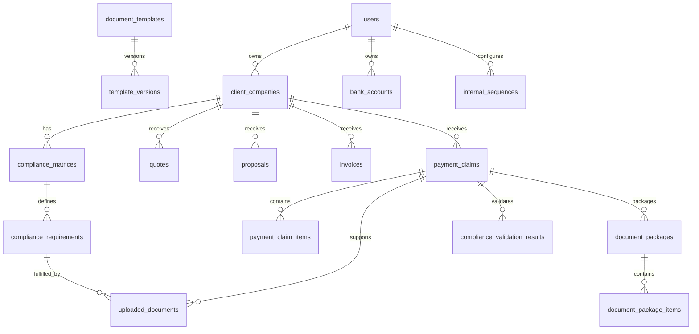

# Modelo de Datos de Nexo

## Grupos de Entidades

### Users and Ownership

- `users`
- `teams`
- `team_members`
- `team_invitations`

### Client Management

- `client_companies`
- `client_contacts`

### Services and Finance

- `services`
- `service_rates`
- `currencies`
- `tax_rates`
- `retention_rates`
- `payment_methods`
- `banks`
- `bank_accounts`

### Business Documents

- `quotes`
- `quote_items`
- `proposals`
- `proposal_items`
- `invoices`
- `invoice_items`
- `payment_claims`
- `payment_claim_items`

### Compliance

- `compliance_matrices`
- `compliance_requirements`
- `document_requirements`
- `uploaded_documents`
- `compliance_validation_results`

### Documents and PDFs

- `document_templates`
- `template_versions`
- `generated_documents`
- `document_packages`
- `document_package_items`

### Sequences and Audit

- `internal_sequences`
- `sequence_counters`
- `sequence_histories`
- `activity_logs`
- `audit_logs`

## Reglas de Relación

- Una `ClientCompany` pertenece a un alcance propietario.
- Una `ComplianceMatrix` pertenece a una `ClientCompany`.
- Un `ComplianceRequirement` pertenece a una `ComplianceMatrix`.
- Una `PaymentClaim` pertenece a una `ClientCompany`.
- Una `PaymentClaim` puede tener muchos `UploadedDocument` a través de requisitos aplicables.
- Un `DocumentPackage` pertenece a una `PaymentClaim`.
- Un `DocumentPackageItem` puede referenciar documentos generados o cargados.

## Borrador ERD

## Índices y Constraints

- Usar foreign keys para relaciones requeridas.
- Agregar índices por owner scope en tablas pertenecientes a usuarios o equipos.
- Agregar constraints únicos para números de documento por owner scope y tipo documental.
- Agregar constraints únicos para números externos de factura por owner scope y empresa cliente.
- Guardar hashes de archivo para validación de integridad.
- Usar soft deletes donde los registros de negocio deban conservarse.
