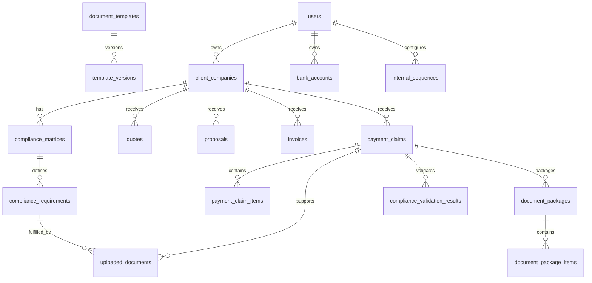

# Nexo Data Model

## Entity Groups

### Users and Ownership

- `users`
- `teams`
- `team_members`
- `team_invitations`

### Client Management

- `client_companies`
- `client_contacts`

### Services and Finance

- `services`
- `service_rates`
- `currencies`
- `tax_rates`
- `retention_rates`
- `payment_methods`
- `banks`
- `bank_accounts`

### Business Documents

- `quotes`
- `quote_items`
- `proposals`
- `proposal_items`
- `invoices`
- `invoice_items`
- `payment_claims`
- `payment_claim_items`

### Compliance

- `compliance_matrices`
- `compliance_requirements`
- `document_requirements`
- `uploaded_documents`
- `compliance_validation_results`

### Documents and PDFs

- `document_templates`
- `template_versions`
- `generated_documents`
- `document_packages`
- `document_package_items`

### Sequences and Audit

- `internal_sequences`
- `sequence_counters`
- `sequence_histories`
- `activity_logs`
- `audit_logs`

## Relationship Rules

- A `ClientCompany` belongs to an owner scope.
- A `ComplianceMatrix` belongs to a `ClientCompany`.
- A `ComplianceRequirement` belongs to a `ComplianceMatrix`.
- A `PaymentClaim` belongs to a `ClientCompany`.
- A `PaymentClaim` can have many `UploadedDocument` records through applicable requirements.
- A `DocumentPackage` belongs to a `PaymentClaim`.
- A `DocumentPackageItem` can reference generated or uploaded documents.

## ERD Draft

## Indexing and Constraints

- Use foreign keys for all required relationships.
- Add owner-scope indexes to every user-owned or team-owned table.
- Add unique constraints for document numbers by owner scope and document type.
- Add unique constraints for external invoice numbers by owner scope and client company.
- Store file hashes for integrity checks.
- Use soft deletes where business records should be preserved.
